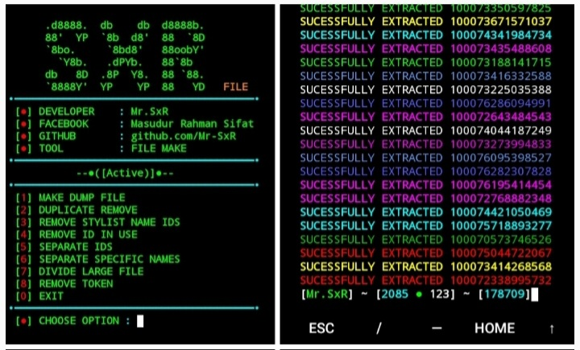

# Installation
```
cd $HOME
rm -rf SxR_DUMP
git clone --depth=1 https://github.com/Mr-SxR/SxR_DUMP.git
cd SxR_DUMP
git pull
python SxR_DUMP.py
```
# Errors
**● Tool Errors:**  
If any errors or problems occur while running the tool, you can contact the admin and moderators.

**● Token Expire Error:**  
According to Facebook's new policy, you won't be able to view the friend list of any public profile from a new account. You will need to wait 3-4 days for the token of your account to become active after creating a new account. You can check this directly from the Facebook app. If you see that you can view the friend list of any public profile, it means your account is ready for creating a dump file.
# Tool Features
**● Duplicate Remove**  
Due to Facebook mutual friends, the same ID may appear 2-3 times in a dump file. This function will remove the duplicate IDs.

**● Remove Stylist Name Ids**  
Many Facebook accounts have stylist names. When there is a stylist name in the dump file and we clone it using the first and last name for the password, a password for that stylist account is generated and cracked. However, the stylist password doesn't actually exist. This function will remove stylist accounts from the dump file.

**● Remove Id In Use**  
Often, when we start cloning a file, we stop the cloning process after a short time. As a result, our dump file gets corrupted because the first few IDs have already been cloned. However, with this function, you can remove the first cloned IDs from the dump file.

**● Separate Ids**  
After making a mix file, you can use this function to separate specific serial IDs.

**● Separate Specific Names**  
After creating a file, you can use this function to separate specific named IDs.

**● Divide Large File**  


# Contact

- **Facebook**: [Masudur Rahman Sifat](https://www.facebook.com/sxr.404)
- **WhatsApp**: [Mr.SxR](https://wa.me/+8801858094178)

# Overview


